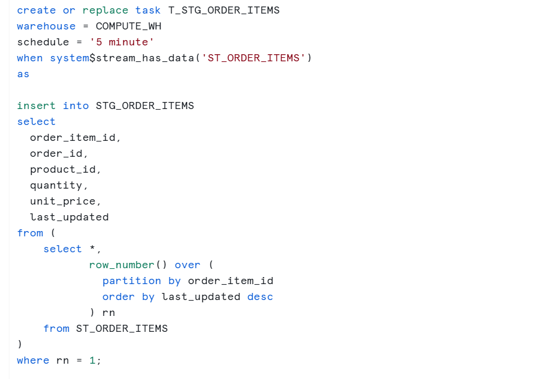
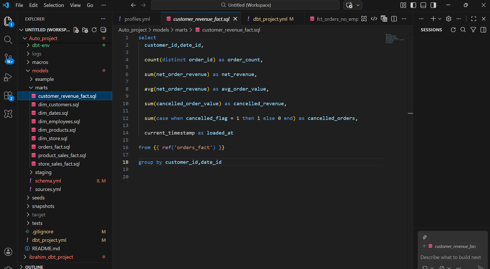
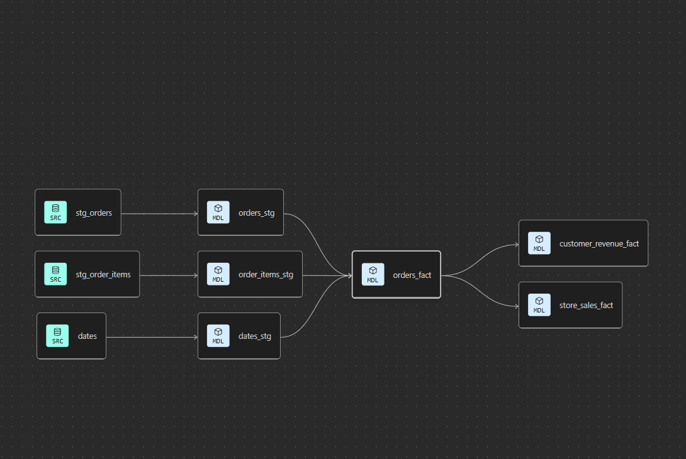
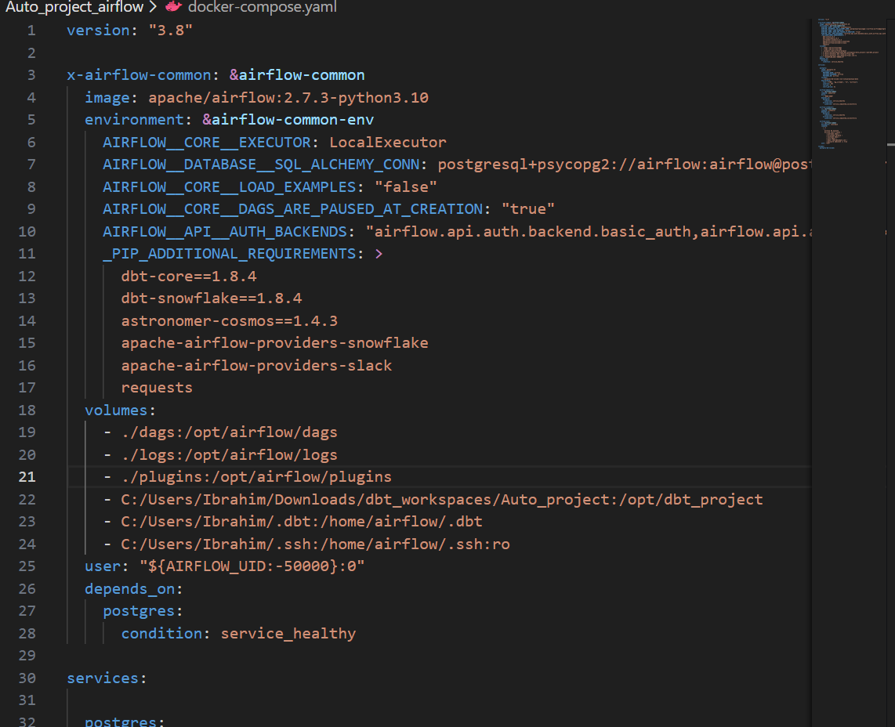
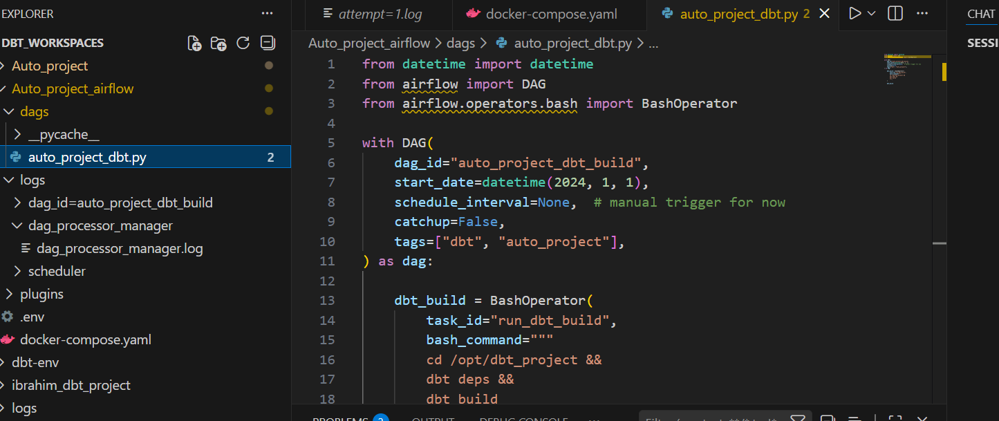
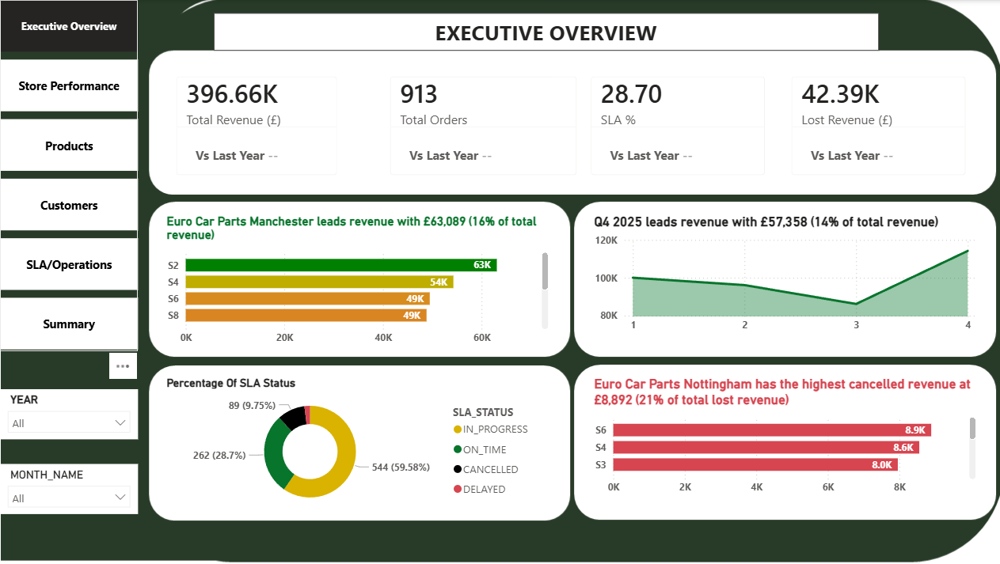
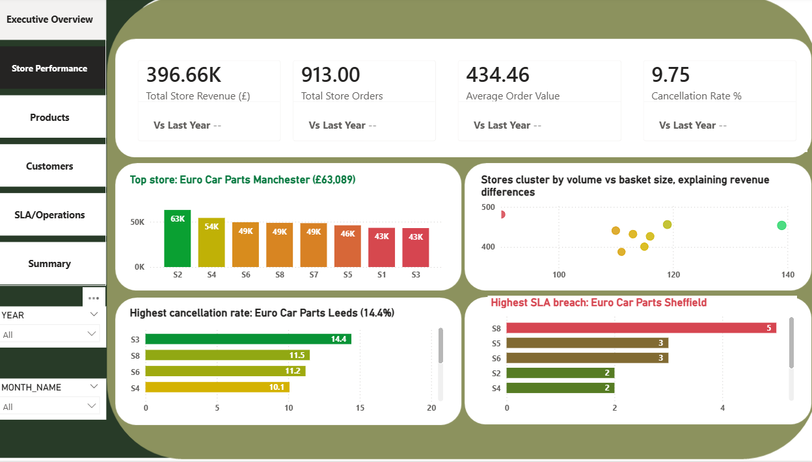
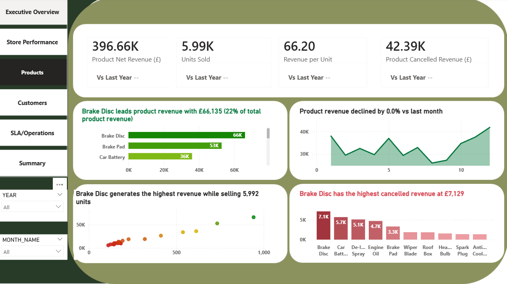
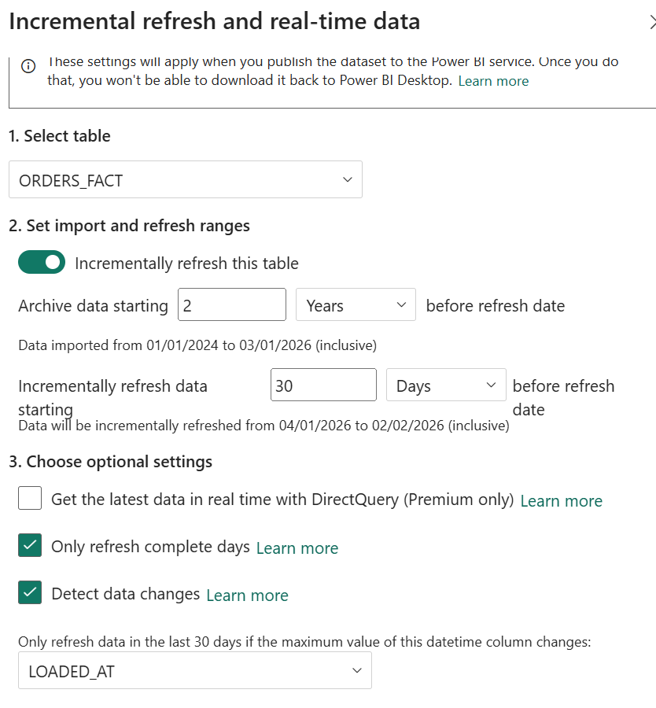

# 🚗 Auto Project – End-to-End Modern Data Platform (Automotive Retail Analytics)
### **📌 Project Overview**

This project simulates a production-grade automotive retail analytics platform inspired by real-world operations such as large UK automotive parts retailers.

It demonstrates:

Near real-time ingestion using Snowpipe

Change Data Capture (CDC) using Snowflake Streams

Technical transformation using Snowflake Tasks

Business transformation using dbt Core

Kimball dimensional modeling

Orchestration using Apache Airflow (Dockerized on Windows)

BI delivery using Power BI with Incremental Refresh

Slack notifications for monitoring

The goal was to design a scalable, cost-conscious, enterprise-ready data platform.

### 🏗 Architecture

Pipeline Flow
S3 → Snowpipe → Landing Tables
        ↓
Snowflake Streams + Tasks (CDC & light cleaning)
        ↓
Airflow (Docker)
        ↓
dbt Core (Staging + Marts)
        ↓
Power BI (Import Mode + Incremental Refresh)
        ↓
Slack Alerts

###  🏗 Architectural Decisions & Trade-offs
Snowpipe + Streams & Tasks for incremental processing: Implemented event-driven ingestion with CDC and light upstream transformations to reduce downstream compute cost and keep dbt models business-focused.
Trade-off: Transformation logic is distributed between Snowflake and dbt, requiring clear documentation.
	
dbt for dimensional modeling (Staging → Marts): Reserved dbt for standardization, modeling, and star schema design to ensure maintainability and semantic clarity.
Trade-off: Additional modeling layer increases build time but strengthens governance and reusability.

Power BI Import Mode: Used Import mode to optimize dashboard performance and reduce warehouse query cost.
Trade-off: Data freshness depends on scheduled refresh rather than real-time queries.

Expose only Gold (Mart) models to BI: Restricted BI access to curated fact and dimension models to enforce metric consistency and cost control.
Trade-off: Requires upfront modeling discipline but improves data governance and reporting reliability.

Airflow (dbt Core) for orchestration: Moved from dbt cloud to dbt core to allow Dockerized Airflow to centralize ingestion and transformation workflows for production parity and extensibility.
Trade-off: Increased setup and operational complexity compared to managed dbt Cloud scheduling.

### 🧠 Business Context

The dataset models an automotive retailer with:

Orders

Order Items

Customers

Stores

Products

Regional Sales Targets

SLA & Delivery Metrics

### Business Questions Answered

Which stores generate the highest revenue?

How much revenue is lost due to cancellations?

Which products drive seasonal performance?

What is SLA on-time performance by region?

What is customer churn rate?

How does revenue compare vs monthly targets?

### 🧱 Tech Stack
Layer	Technology
Storage	AWS S3
Data Warehouse	Snowflake
CDC	Snowflake Streams
Technical Transformation	Snowflake Tasks
Business Transformation	dbt Core
Orchestration	Apache Airflow (Docker)
Visualization	Power BI
Monitoring	Slack Webhooks

### 🔄 Ingestion & CDC Strategy
Snowpipe

Auto-ingests CSV files from S3

Event-driven architecture

Eliminates manual load jobs

Streams + Tasks (Design Decision)

Used for:

Deduplication

Basic casting

Light standardization

Maintaining incremental upstream state

Why not move everything to dbt?

Because:

Keeping technical cleaning upstream keeps dbt models cleaner and more readable

Avoids overloading dbt with CDC logic

Reduces repeated full scans 

Helps in handling of late arriving data 

Improves Snowflake compute efficiency

This separation improves maintainability and cost control.

### 📊 Data Modeling 
Medallion Architecture bronze,silver & gold 
(Facts & dimensions )

Kimball Star Schema

Facts : Have it own atomic line table 

orders_fact → 1 row per order

store_sales_fact → 1 row per store per day

product_sales_fact → 1 row per product per day

customer_revenue_fact → 1 row per customer

Dimensions :Provide contexts to the facts 

dim_dates

dim_stores

dim_products

dim_customers

Modeling Principles Applied

Surrogate keys (date_id)

Tested the quality of the data using single test , generic test and customised test as where appropriate 

Grain awareness enbaling same metric definition across semantic layer

Avoided double aggregation

Cancelled revenue excluded from net revenue 

Single source of truth defined at order grain

### ⚙ Orchestration (Current State)

Airflow is Dockerized and runs locally using docker-compose.

Current Orchestration

Airflow DAG triggers dbt build

dbt dependency graph handled via Cosmos

Success/failure visible in Airflow UI

### 🚀 Planned Full Enterprise Orchestration (In Progress)

Next phase:

Snowflake Freshness Check
    ↓
dbt build (staging + marts)
    ↓
Power BI dataset refresh
    ↓
Slack success/failure alerts

Goal:

Centralized orchestration

Smart watermark-based execution

Avoid unnecessary dbt runs

Full end-to-end observability

### 📈 Power BI Layer
Features:

Executive Overview

Store Performance

SLA & Operations

Product Performance

Incremental Refresh (Date-based partitioning)

KPIs include:

Total Revenue

Revenue vs Last Year %

Cancelled Revenue

SLA On-Time %

Customer Churn Rate

Revenue vs Target

### 💰 Cost Optimization Strategy

Designed with cost-awareness in mind:

X-Small Snowflake warehouse

Incremental CDC using Streams

Avoided redundant dbt incremental materialization

Used Import mode with Incremental Refresh in Power BI

Watermark gating to avoid unnecessary dbt builds

Separated technical cleaning from business transformation

This prevents:

Repeated full-table scans

Excessive compute consumption

Over-complicated dbt models

🖥 Running Locally
1️⃣ Clone Repo
git clone <repo_url>
cd auto_project
2️⃣ Start Airflow (Docker)
docker-compose up -d

Access Airflow:

http://localhost:8080
### 🧩 Future Improvements

Full orchestration from ingestion → BI refresh

Automated data quality checks

ML-based revenue forecasting

Deployment to MWAA / Astronomer

CI pipeline for dbt testing

Enhanced monitoring dashboard

Handling Slow changing dimension models via snapshots in dbt 

### 🏆 What This Project Demonstrates

End-to-end modern data platform design

Event-driven ingestion

CDC architecture

Dimensional modeling discipline

Airflow orchestration capability

BI delivery best practices

Cost-conscious Snowflake usage

Production-oriented thinking
