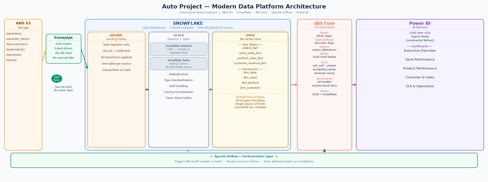
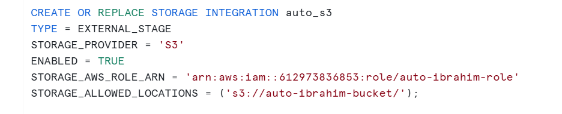
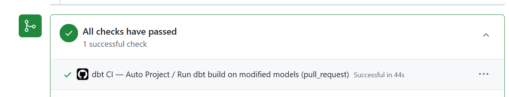

# 🚗 Auto Project — End-to-End Modern Data Platform
**Automotive Retail Analytics | Snowflake · dbt Core · Airflow · Power BI**

---

## 📌 Overview


This project is a production-style analytics platform built for a UK automotive retail business covering orders, customers, stores, products, SLA, and delivery performance. It is not a tutorial or a guided walkthrough. Every architectural decision was made deliberately, with a real constraint or tradeoff in mind.

The platform answers a specific question: how do you go from raw operational data landing in cloud storage to governed, stakeholder-ready analytics without full-table scans, without duplicate transformation logic, and without blowing up warehouse costs?

The answer is a layered architecture where each component owns a clearly defined responsibility:

- **AWS S3** — raw file storage, structured by domain
- **Snowpipe** — event-driven auto-ingestion, no scheduled load jobs
- **Snowflake Streams + Tasks** — CDC and light standardisation before any business logic runs
- **dbt Core** — Kimball dimensional modeling, SCD Type 2 snapshots, data quality enforcement, documentation
- **Apache Airflow** — orchestration with success/failure alerting via Slack
- **Power BI** — audience-specific dashboards, Import Mode + Incremental Refresh for cost control
- **GitHub Actions** — automated CI running dbt build on every pull request to main

---

## 🧠 Business Context

The platform was built around real commercial questions that an automotive retailer would actually ask. The schema — orders, order items, customers, stores, regions, products, SLA, and regional targets was designed to support those questions, not the other way around.

| Business Question | Fact Table | Key Dimensions |
|---|---|---|
| Which stores generate the highest net revenue? | store_sales_fact | dim_store, dim_date |
| How much revenue is lost to cancellations? | orders_fact | dim_customer, dim_store, dim_date |
| What is SLA on-time delivery performance by region? | orders_fact | dim_store, dim_date |
| Which products drive seasonal peaks? | product_sales_fact | dim_product, dim_date |
| How does store revenue track against monthly targets? | store_sales_fact | dim_store, dim_date |
| What is customer churn rate over time? | customer_revenue_fact | dim_customer, dim_date |

Cancelled revenue is tracked separately from net revenue throughout the model inflating net figures with cancellations is a common modeling mistake that makes executive dashboards misleading. Isolation was a deliberate grain decision to enforce a consistent metric definition across all semantic layers, not an afterthought.

---

## 🏗 Architecture & Key Design Decisions


**Why Snowflake**  
The platform was designed for analytics delivery, not data science or ML experimentation. Snowflake's separation of storage and compute, native support for semi-structured data, and first-class SQL interface made it the right fit for a use case where the primary consumers are analysts and BI tools — not notebooks or ML pipelines. Databricks is a strong platform, but its strengths are better matched to engineering-heavy, ML-centric workloads. For governed analytics delivery on a star schema, Snowflake is the cleaner choice.

**Why CDC in Snowflake, not dbt**  
The tempting approach is to handle everything in dbt — incremental models, deduplication, the lot. The problem is that dbt's incremental logic runs on a schedule, re-reads source tables to find new records, and adds complexity to models that should be focused on business logic.

Snowflake Streams solve this natively. A stream attached to a landing table captures only the rows that have changed since the last time it was consumed. No re-scanning. No watermark management. No incremental model boilerplate in dbt. When the Task runs, it processes the change set and writes clean records into Silver — and dbt never has to think about whether it has seen a record before.

**Why technical transforms happen before dbt**  
dbt's job in this platform is dimensional modeling and business logic. It should not be doing deduplication or type casting — those are data engineering concerns, not analytics concerns. Snowflake Tasks run every 5 minutes and handle deduplication on business keys, type standardisation, and writing clean Silver tables. This keeps the Silver → Gold boundary clean. Anyone reading a dbt model sees business intent, not plumbing.

**Why IAM role-based auth, not access keys**  
Static access keys stored in code or environment variables are a security liability — they can be leaked, they don't expire automatically, and they're hard to rotate at scale. Snowflake's Storage Integration uses a trust relationship between Snowflake's AWS account and the S3 bucket, scoped to a specific external ID. No credentials are stored anywhere in the codebase.

---

## 🧱 Tech Stack

| Layer | Tool | Rationale |
|---|---|---|
| Cloud Storage | AWS S3 | Structured domain layout, native Snowpipe event trigger |
| Data Warehouse | Snowflake (X-Small) | Separation of storage/compute, SQL-first, analytics-optimised |
| Ingestion | Snowpipe (auto-ingest) | Event-driven, no scheduled load jobs, per-file traceability |
| CDC + Standardisation | Snowflake Streams + Tasks | Native CDC without full-table scans, keeps dbt focused |
| Transformation | dbt Core | Business logic, Kimball modeling, SCD Type 2 snapshots, testing, documentation |
| Orchestration | Apache Airflow (Docker) | Dependency management, local production parity, portable |
| BI | Power BI | Import Mode + Incremental Refresh, audience-specific delivery |
| Monitoring | Slack webhooks | Real-time success/failure alerting per DAG run |
| Version Control | Git + GitHub | Feature branch workflow, full commit history |
| CI | GitHub Actions | Automated dbt build + tests on every PR to main, merge blocked on failure |

---

## 🔄 Ingestion & CDC

**S3 Bucket Layout**

Raw CSV extracts land in a domain-separated structure:

```
s3://<bucket>/raw/customers/
s3://<bucket>/raw/orders/
s3://<bucket>/raw/order_items/
s3://<bucket>/raw/products/
s3://<bucket>/raw/stores/
```

Domain separation matters for two reasons: it makes Snowpipe event routing straightforward (each pipe watches one prefix), and a new data source can be onboarded without touching the layout of existing ones.

**Snowflake–S3 Integration (IAM Role–Based)**  


Access is configured via a Snowflake Storage Integration — a trust relationship between Snowflake and the S3 bucket using an external ID. No static credentials exist in the codebase or environment.

**Streams + Tasks (CDC → Silver)**  


A Snowflake Stream is attached to each landing table. The stream captures inserts and updates as a change record set — only what has changed since the last consumption, nothing more.

A Snowflake Task runs every 5 minutes. For each source it reads the stream's change records, deduplicates on business key and latest timestamp, applies light standardisation, and writes clean records into the corresponding Silver table. If no new files have landed, the stream is empty and the Task completes instantly. No compute is wasted re-reading unchanged data.

---

## 🧪 dbt Transformation & Modeling


**Medallion Layers**

| Layer | Owner | Content |
|---|---|---|
| Bronze | Snowpipe | Raw landing tables — unmodified source data, VARCHAR columns |
| Silver | Snowflake Tasks | Cleaned, typed, deduped — technical concerns resolved |
| Gold | dbt Core | Facts and dimensions — business logic, Kimball modeling |

dbt reads from Silver. It never touches Bronze. This boundary is intentional — dbt models express business logic, and business logic should start from clean data.

**Kimball Star Schema**

Fact Tables:

| Table | Grain | Description |
|---|---|---|
| orders_fact | 1 row per order | Order-level revenue, status, cancellation flag |
| store_sales_fact | 1 row per store per day | Aggregated daily revenue per store |
| product_sales_fact | 1 row per product per day | Daily product volume and revenue |
| customer_revenue_fact | 1 row per customer per day | Revenue, order count, cancellation indicators |

`store_sales_fact` and `customer_revenue_fact` both derive from `orders_fact` via `{{ ref('orders_fact') }}` — revenue logic is defined once and flows downstream automatically. A fix to cancellation logic in `orders_fact` propagates to both downstream models on the next dbt run without any manual intervention.

`product_sales_fact` is the only fact that reads from staging directly (`order_items_stg` and `orders_stg`) rather than from `orders_fact`. This is intentional, not a limitation. `orders_fact` aggregates all line items to order level — `product_id` and per-product `quantity` are lost at that grain. Reading from `orders_fact` and joining back to `order_items_stg` would create a fan trap: a single order containing five products would fan the aggregated order-level revenue across every product row, overstating product revenue figures by a factor of the line item count. The correct approach is to aggregate from the atomic grain source directly. The trade-off is that cancellation logic must be kept consistent between `orders_fact` and `product_sales_fact` manually — this is a candidate for a shared dbt macro to enforce a single definition.

**Dimension Tables with SCD Type 2**

| Table | Snapshot Strategy | Tracked Attributes |
|---|---|---|
| dim_store | check on store_name, region, country | Region reassignment, store renaming |
| dim_product | timestamp on processed_at | Category, brand, margin, seasonality |
| dim_customer | timestamp on processed_at | derived_region, city |
| dim_date | No snapshot — dates are immutable | N/A |

Dimension history is managed via `dbt snapshot`. Each snapshot table carries `dbt_valid_from`, `dbt_valid_to`, and an `is_current` flag. Dim models expose these columns so Power BI can either filter `is_current = true` for standard reporting or use `valid_from` / `valid_to` for point-in-time joins to historical fact data.

The strategy choice between `timestamp` and `check` was deliberate:

- `products_snapshot` and `customers_snapshot` use `timestamp` on `processed_at` — a reliable source-system timestamp. dbt opens a new SCD row only when `processed_at` advances, meaning a real update occurred in the source
- `stores_snapshot` uses `check` because `stores_stg` generates `loaded_at` via `current_timestamp` at query execution time. That timestamp advances on every dbt run regardless of whether store data changed — using it as `updated_at` would create noise SCD rows on every execution. The `check` strategy compares actual column values instead, opening a new historical row only when `store_name`, `region`, or `country` genuinely changes

**Why this matters for analytics:**  
Without SCD Type 2, a product margin change retroactively alters all historical revenue calculations. A customer who moved region would have all past orders misattributed to their current region. With snapshots, each order can be joined to the dimension record that was active at the time of the transaction — not today's values.

**Data Quality**

| Test Type | What It Catches |
|---|---|
| not_null | Missing values on non-nullable keys and measures |
| unique | Duplicate rows violating grain definitions |
| accepted_values | Invalid status codes, unexpected categorisations |
| Singular: revenue sanity | Net revenue and gross order value are never zero or negative |

Test failures block downstream models from building. Tests run both locally before every PR and automatically in CI on every pull request to main.

---

## 🔁 CI — GitHub Actions


Every pull request to `main` triggers an automated dbt build via GitHub Actions before any merge is permitted.

**What the workflow does:**
1. Spins up a clean Ubuntu environment on every PR
2. Installs `dbt-snowflake`
3. Writes `profiles.yml` at runtime using GitHub Secrets — no credentials in the codebase
4. Connects to Snowflake and runs `dbt build --select state:modified+` — builds and tests only modified models plus their downstream dependents
5. Reports pass or fail directly on the PR — merge is blocked if any model or test fails
6. Uploads the dbt manifest as an artifact for state comparison on the next run

**Why `state:modified+` and not full `dbt build`:**  
Running all 18 models and 54 tests on every small change would be slow and unnecessary. The `state:modified+` selector compares the current branch against the last known manifest and builds only what changed plus downstream. A change to `orders_fact` automatically triggers `store_sales_fact` and `customer_revenue_fact` without rebuilding unrelated models.

**Secrets and isolation:**  
Snowflake credentials are stored as GitHub Secrets and injected at runtime. CI builds write to `AUTO_SCHEMA_CI` — a dedicated Snowflake schema completely separate from the dev schema — so CI output never touches real data.

---

## ⚙️ Orchestration


Airflow runs in Docker for local production parity. The DAG triggers `dbt build` (models and tests together), routes to success or failure, and sends a Slack alert either way.

Current pipeline:
```
dbt build (models + tests) → branch → notify_success
                                   └──► notify_failure
```

Planned production pipeline:
```
Snowflake freshness check → dbt build → Power BI dataset refresh → Slack alert
```

The freshness check is the missing piece — only running dbt if new data has actually landed rather than on a fixed schedule.

---

## 📊 Power BI Delivery


Power BI connects only to Gold mart tables. Raw and Silver layers are never exposed — a deliberate governance decision that keeps metric definitions consistent and prevents analysts from querying undeduped or untyped data.

| Decision | Rationale |
|---|---|
| Import Mode | Eliminates repeated Snowflake queries during report interaction — credits only spent on scheduled refresh |
| Incremental Refresh | Only recent date partitions reload — avoids full dataset rebuild on every refresh |
| Gold-only connection | Prevents BI tools from touching Bronze/Silver — cost and governance control |

| Dashboard | Primary Audience | Key Questions |
|---|---|---|
| Executive Overview | Leadership | Revenue trend, SLA%, cancellation rate |
| Store Performance | Regional managers | Revenue by store, regional comparison |
| Product Performance | Product & marketing | Top products, seasonal trends, category mix |
| Customer & Sales | Commercial teams | Top customers, acquisition channel, churn indicators |
| SLA & Operations | Ops stakeholders | On-time delivery rate, SLA breach by region |

---

## 💰 Cost Optimisation

| Decision | Cost Impact |
|---|---|
| Snowpipe auto-ingest | Pay per file loaded, not per scheduled job run |
| CDC via Streams | Tasks process only changed rows — compute scales with delta, not table size |
| Tasks handle dedupe/standardisation | Lightweight SQL, not full warehouse-scale transforms |
| dbt avoids duplicate incremental logic | No re-scanning of Silver tables for records dbt has already seen |
| Power BI Import Mode | Snowflake only queried at scheduled refresh time, not on every report interaction |
| Incremental Refresh | Only recent date partitions reload — full dataset refresh avoided |
| Gold-only BI exposure | Analysts cannot accidentally run expensive queries against unoptimised raw tables |
| CI runs state:modified+ | GitHub Actions only builds changed models — avoids full project rebuild on every PR |

---

## ▶️ Run Locally

Prerequisites: Docker Desktop (4GB+ RAM), Git, Python 3.11+

```bash
# 1. Clone the repo
git clone <repo_url>
cd auto_project

# 2. Activate the virtual environment
.\dbt-env\Scripts\activate        # Windows
source dbt-env/bin/activate       # Mac/Linux

# 3. Install dbt
pip install dbt-snowflake==1.9.0

# 4. Run snapshots first (creates SCD Type 2 history tables)
dbt snapshot

# 5. Build all models and run tests
dbt build

# 6. Start Airflow
docker-compose up -d
# http://localhost:8080
```

---

## ⚠️ Known Limitations

| Limitation | Detail |
|---|---|
| Mock source data | CSVs are generated to simulate a UK automotive retailer — not live operational data |
| Orchestration gap | Airflow triggers dbt on a schedule rather than confirmed data arrival. A Snowflake freshness check before dbt build would make the pipeline watermark-driven |
| Single-node Airflow | LocalExecutor only. Production would use CeleryExecutor or KubernetesExecutor |

---

## 🗺 Production Roadmap

| Priority | Item | Detail |
|---|---|---|
| 1 | Close the orchestration loop | Snowflake freshness check → dbt build → Power BI dataset refresh → Slack. Makes the pipeline watermark-driven rather than schedule-driven |
| 2 | Automated data quality alerting | Surface dbt test failures to Slack in real time rather than requiring manual log inspection |
| 3 | Deploy to MWAA / Astronomer | Move Airflow off Docker onto a managed platform for reliability and scalability |

---

## 📁 Supporting Documentation

| File | Contents |
|---|---|
| DATA_DICTIONARY.md | Column-level definitions for all Gold mart tables, grain statements and business rules per fact |
| LINEAGE.md | Full data lineage from S3 source files to Power BI dashboard fields, including metric-level traces |
| ADR.md | Architecture Decision Records — CDC placement, dbt layer boundaries, SCD strategy selection, Power BI mode, cost decisions |

---

## 🏆 What This Project Demonstrates

- Production-style modern data platform architecture with real cost and governance constraints
- Cloud-native security — IAM role-based Snowflake–S3 integration, no static credentials
- CDC-first incremental processing — Streams eliminate full-table scans at every layer
- Clean separation of technical transformation (Snowflake) and business logic (dbt)
- Kimball dimensional modeling with grain discipline and metric isolation
- SCD Type 2 via dbt snapshots — dimension history preserved with deliberate strategy selection per source
- Automated CI via GitHub Actions — dbt build on every PR, merge blocked on test failure, state-aware to avoid unnecessary rebuilds
- Orchestrated, observable workflows with real alerting
- Stakeholder-led BI delivery with performance and cost decisions built in
