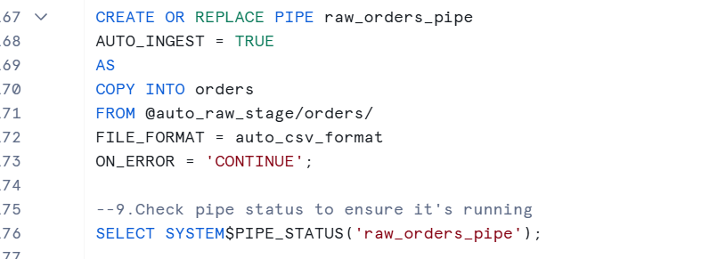
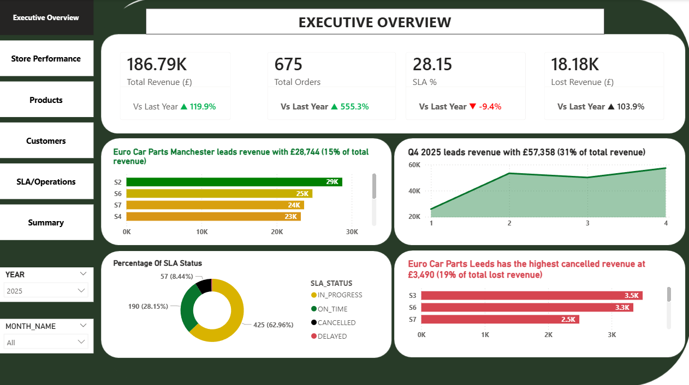

# 🚗 Auto Project — End-to-End Modern Data Platform

## Automotive Retail Analytics | Snowflake + dbt + Airflow + Power BI

### 📌 Overview

This project simulates a production-style analytics platform for a UK automotive retail business (orders, customers, stores, products, SLA & delivery). The focus is on event-driven ingestion, incremental processing, governed modeling, and cost-efficient BI delivery.

Secure cloud ingestion from AWS S3 → Snowflake using IAM role–based authentication

Near real-time ingestion with Snowpipe (auto-ingest)

Incremental CDC with Snowflake Streams to avoid full-table scans

Light technical transforms using Snowflake Tasks (dedupe + standardization)

Business modeling in dbt Core using Medallion Architecture (Bronze → Silver → Gold)

Kimball Star Schema design with strict grain discipline and a single source of truth

Orchestration with Apache Airflow (Dockerized) + monitoring via Slack alerts

Power BI delivery using Import Mode + Incremental Refresh for performance and cost control

### 🏗 Architecture 

Flow
AWS S3 (Storage)
→ Snowpipe (Auto-ingest)
→ Snowflake Landing Tables (Bronze)
→ Streams + Tasks (CDC + light transforms) (Silver)
→ Airflow Orchestration
→ dbt Core (Silver refinements + Gold marts)
→ Power BI (Gold only, Import + Incremental Refresh)
→ Slack alerts (success/failure monitoring)

Key design choice: Technical changes (CDC, dedupe, light standardization) start in Snowflake to keep dbt focused on business logic and dimensional modeling.

### 🧠 Business Context

The dataset represents an automotive retailer with:

Orders, Order Items

Customers

Stores & Regions

Products

SLA / Delivery metrics

Regional Sales Targets

Example Questions Answered

Which stores generate the highest revenue?

How much revenue is lost to cancellations?

What is SLA on-time performance by region?

Which products drive seasonal performance?

How does revenue track vs monthly targets?

What is customer churn rate over time?

### 🧱 Tech Stack

Storage: AWS S3

Warehouse / Lakehouse: Snowflake

Ingestion: Snowpipe (auto-ingest)

CDC + Light Transform: Streams + Tasks

Transformation / Modeling: dbt Core

Orchestration: Apache Airflow (Docker)

BI: Power BI (Import + Incremental Refresh)

Monitoring: Slack webhooks

Version Control: Git + GitHub

### 🔄 Ingestion & CDC (Step-by-Step)

1) Data Storage in AWS S3

Raw CSV extracts land in a structured S3 layout (typical production convention):

s3://<bucket>/raw/customers/

s3://<bucket>/raw/orders/

s3://<bucket>/raw/order_items/

s3://<bucket>/raw/products/

s3://<bucket>/raw/stores/

This supports:

Clear domain separation

Easier event routing for Snowpipe auto-ingest

Scalable onboarding of new sources

2) Secure Snowflake Access to S3 (IAM Role–Based)
   

To keep access secure and cloud-native, Snowflake loads from S3 via an IAM role. In Snowflake, this is implemented using:

Storage Integration (trust relationship + external ID)

External Stage referencing the S3 path

No static keys stored in code

This demonstrates enterprise-grade security and aligns with best practices for external loading.

3) Snowpipe Auto-Ingestion into Landing Tables (Bronze)

For each dataset, the same ingestion pattern is used:

a) Create a Landing Table in Snowflake (raw/landing = Bronze entry point)
b) Create a File Format (CSV rules, date parsing, delimiters)
c) Create an External Stage (S3 path + integration + file format)
d) Create a Pipe to auto-ingest from the stage into the landing table
e) Validate ingestion using Pipe Status (ensure files are processed)

This pattern is repeated per landing table to support modularity and traceability.

✅ Outcome: Event-driven ingestion with Snowpipe (no manual load jobs).

4) Incremental CDC with Snowflake Streams (No Full Scans)
   

After data lands, a standard stream is created on each landing table to capture changes:

Inserts / updates captured as change records

Prevents reprocessing entire tables when new files arrive

Supports incremental processing at low cost

✅ Outcome: CDC-driven incremental loads.

5) Light Transform + Deduplication with Snowflake Tasks (Silver)

A scheduled Snowflake Task runs every 5 minutes to:

Deduplicate records (based on business keys + latest timestamp)

Apply basic standardization (types, casing, null handling)

Write cleaned outputs into Silver tables

Runtime behavior:

If no new data arrives, PIPE_STATUS shows no ingestion activity

Streams and tasks only process new changes

✅ Outcome: clean + incremental Silver tables before dbt begins.

### 🧪 dbt Core Transformation & Modeling
 
Medallion Architecture

Bronze: Snowpipe landing tables (raw ingestion)

Silver: Snowflake task outputs (cleaned + standardized + deduped)

Gold: dbt marts (facts + dimensions)

Why dbt starts from Silver

dbt pulls from the Silver source models and focuses on:

Business logic

Consistent definitions

Dimensional modeling

Governance (tests + documentation)

Design decision: We intentionally avoided duplicating incremental logic in dbt because CDC is already handled upstream (Streams + Tasks). This keeps dbt models simpler, clearer, and easier to maintain.

Kimball Modeling (Star Schema + Grain Discipline)

Gold models follow Kimball best practices:

Clear grain per fact table

No double aggregation

Single source of truth at atomic level

Cancelled revenue handled separately to avoid inflating net revenue

Metrics defined once and reused consistently

Example Facts (Atomic grains)

fact_orders → 1 row per order

fact_store_sales_daily → 1 row per store per day

fact_product_sales_daily → 1 row per product per day

fact_customer_revenue → 1 row per customer

Dimensions

dim_date

dim_store

dim_product

dim_customer

Data Quality (Tests + Docs)

Data quality is enforced using dbt:

Generic tests (not_null, unique, accepted_values)

Singular tests (net_revenue and gross order value is not zero or negative)

Custom tests where needed

Model documentation to support maintainability and onboarding

### ⚙️ Orchestration (Airflow)
 

Airflow is dockerized for local production parity:

Runs via docker-compose

Triggers dbt build

Orchestration visibility in Airflow UI

Prepares the platform for future enterprise deployment (MWAA/Astronomer)

Current State

Airflow triggers dbt workflows (dependency graph handled in dbt)

Success/failure visible in Airflow UI

Planned Next Phase (Enterprise Orchestration)

Snowflake freshness check / ingestion check
→ dbt build (staging + marts)
→ Power BI dataset refresh
→ Slack alerts (success/failure)

Goal:

End-to-end observability

Avoid unnecessary dbt runs

Watermark-driven execution

### 📊 Power BI Delivery (Gold Only)
 

Power BI connects only to Gold marts, not raw tables.
This ensures:

Consistent metrics

Better performance

Controlled warehouse costs

Performance / Cost Decisions

Import Mode (avoids constant Snowflake querying)

Incremental Refresh (date-based partitioning)

Carefully designed measures + slicers for usability

Audience-Driven Dashboards

Executive Overview (leadership)

Store Performance (regional managers)

Product Performance (product/marketing)

Customer & Sales (commercial teams)

SLA & Operations (ops stakeholders)

### 💰 Cost Optimisation Strategy

Designed to be scalable and cost-conscious:

X-Small Snowflake warehouse

CDC via Streams (no full scans)

Tasks only run lightweight standardization + dedupe

dbt does business modeling without duplicate incremental logic

Power BI Import mode + incremental refresh reduces compute

Gold-only exposure controls query footprint

▶️ Run Locally

Clone repo

git clone <repo_url>
cd auto_project

Start Airflow (Docker)

docker-compose up -d

Open Airflow UI
http://localhost:8080

### 🧩 Future Improvements

Full orchestration: ingestion → dbt → Power BI refresh → Slack

Automated data quality monitoring & alerting

dbt snapshots for slowly changing dimensions (SCD)

CI pipeline for dbt tests (PR checks)

Deploy to MWAA / Astronomer

ML-based forecasting (revenue / demand)

### 🏆 What This Project Demonstrates

Production-style modern data platform thinking

Secure cloud ingestion (AWS + Snowflake IAM integration)

Event-driven ingestion + CDC architecture

Clear separation of technical vs business transformation

Dimensional modeling discipline + grain awareness

Orchestrated workflows and monitoring

Cost-efficient BI delivery for stakeholders
